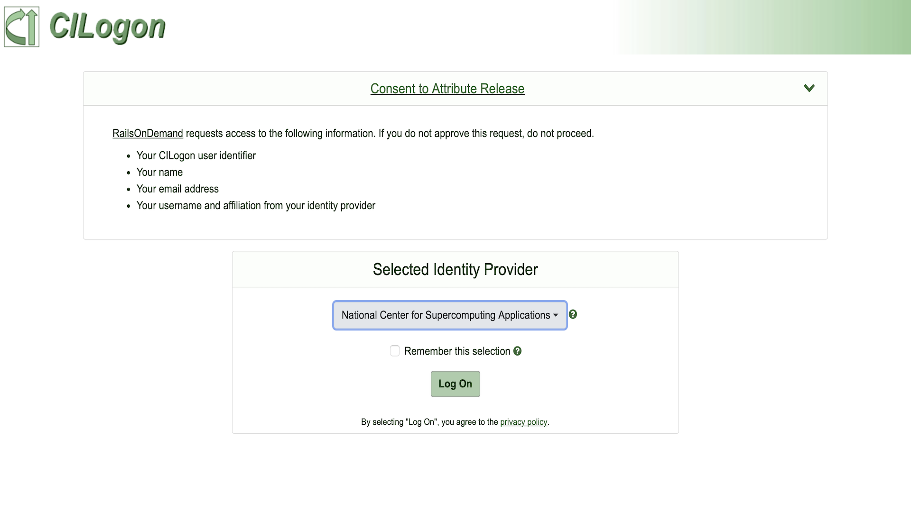
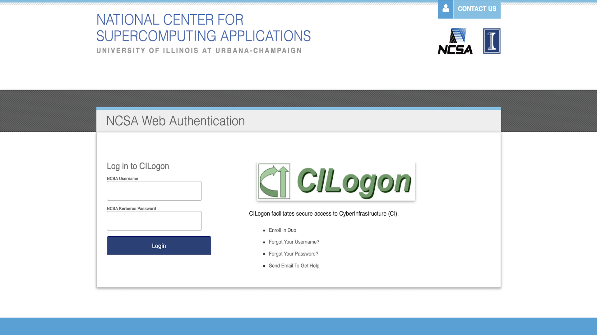

.. _access:

Accessing The System
=========================
.. Note::
    All users must have a valid NCSA account with DUO setup in order to access the TGI RAILS 
    system. For help, please see the :ref:`accounts` page.

Connecting with SSH
-----------------------------

Direct access to TGI RAILS is provided via SSH. Most Unix-like operating systems provide an SSH 
client by default, which can be accessed by typing the `ssh` command in a terminal. For systems 
that don't provide a default ssh client such as Windows, we recommend using the 
`PuTTY <https://putty.org>`_ SSH client.

To connect to RAILs via ssh, use the following command where `<username>` is replaced by your NCSA 
account username:

.. code-block:: terminal
    ssh <username>@rails.ncsa.illinois.edu

**Host Key Verification**

The first time you connect to RAILS via ssh, you see a warning like this: 

.. code-block:: terminal
    The authenticity of host 'rails.ncsa.illinois.edu can't be established. ECDSA key fingerprint is SHA256:XXXX...XXXX. Are you sure you want to continue connecting (yes/no)?

This is normal and is a security feature of SSH. Your SSH client warns you when connecting to a 
new host for the first time. If you accept the prompt the host key will be saved on your local 
machine and used to verify the server on subsequent connections, making sure the server you're 
connecting with is the same each time.

`Railsl1 host fingerprint : SHA256:/07w1vwaxdcRS0i/kzOoPEwpnkJq7ExK/Q1576F0nDs`

**Authentication and DUO MFA**

Upon connecting, you will be prompted to enter your NCSA password.

`<username>@rails.ncsa.illinois.edu's password:`

After successfully entering your password, you'll be prompted to authenticate with a two-factor 
method with a message like this:

.. code-block:: terminal
    (<username>@rails.ncsa.illinois.edu) Duo two-factor login for <username>
    Enter a passcode or select one of the following options:

    1. Duo Push to XXX-XXX-1234
    2. Phone call to XXX-XXX-1234
    3. SMS passcodes to XXX-XXX-1234

    Passcode or option (1-3):

NCSA requires multifactor authentication (MFA) for all users. You can choose one of the options 
listed to authenticate. Once your MFA method is accepted, you will be connected to one of RAILS 
login nodes!

.. Warning::
    **Login node usage policy**
    
    Login nodes are shared among all users and are intended for file management, job submission, 
    and other tasks that do not require significant computational resources. Please do not run 
    computationally intensive jobs on the login nodes. Please see the :ref:`job submission` page 
    for information on submitting jobs to the compute nodes.

**Connecting with Open OnDemand**
-----------------------------------

.. Warning::
    If you are a new user on TGI RAILS, you must log in to RAILS via `ssh`, to initialize your 
    account, before you can access the system via Open OnDemand.

You can access the Open OnDemand interface by navigating in a web browser to 
https://railsondemand.ncsa.illinois.edu

This should display the following CILogon page:

Select "National Center for Supercomputing Applications" as your Identity Provider in the dropdown 
and click log on. This will open the NCSA Login page where you can enter your NCSA username and 
password. After entering your credentials, you will be prompted to authenticate with DUO.

Once you have authenticated with DUO, you will be taken to the RAILS OnDemand dashboard where you 
can access the various apps and tools available on TGI RAILS.

**Troubleshooting and Connection Help** 
--------------------------------------------

**Connecting to a specific node**

When you connectted to TGI RAILS via ssh, railsl1 or railsl2. You can determine which login node 
you are connected to by looking at the command prompt. It should look like this:
.. code-block:: terminal
    [<username>@railsl1 ~]$

The rails.ncsa.illinois.edu hostname is a round-robin DNS entry that points to one of the two 
login nodes, railsl1 or railsl2. If you are having trouble connecting to the system, you can try 
connecting to a specific login node by using the hostname railsl1.ncsa.illinois.edu or 
railsl2.ncsa.illinois.edu.

**ssh keyboard-interactive**

For command line ssh clients, make sure to use the following settings if you have trouble logging 
in to TGI RAILS:

.. code-block:: terminal
    ssh -o PreferredAuthentications=keyboard-interactive,password

**SSH-Tunneling**

For some applications it may be desirable to connect to a compute node directly. While compute 
nodes are not directly accessible from the WAN, you can create an SSH tunnel to a compute node 
through a login node.

This can be accomplished with the following command:

.. code-block:: terminal
    ssh -L <local_port>:<compute_node>:<compute_port> <username>@<login_node>

**maintaining persistent sessions: tmux**

tmux is available on the login nodes to maintain persistent sessions.
See the tmux man page for more information. Use the targeted login
hostnames (railsl1 or railsl2) to attach to the login node where
you started tmux after making note of the hostname. Avoid the
round-robin hostname when using tmux.

**SSH Key Pairs**

Use of ssh-key pairs is disabled for general use. Please contact NCSA
Help at help@ncsa.illinois.edu for key-pair use by Gateway allocations.
