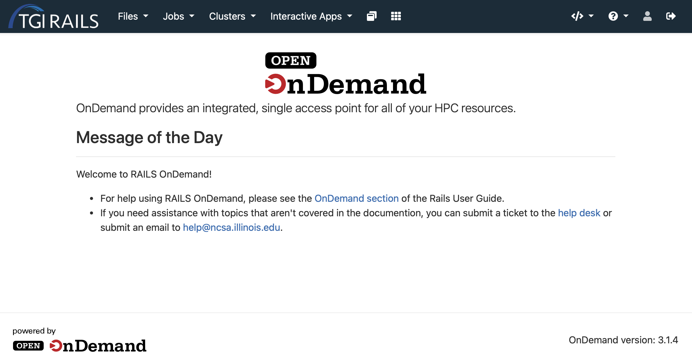

.. _ood:

Open OnDemand
=============

Open OnDemand provides a way to access and interact with TGI Rails resouces in a browser. 
OnDemand's Web interface provides a way to view, edit, download, and upload files, submit, manage 
and monitor jobs, and use interactive applications such as JupyterLab, without neededing a SSH 
terminal connection. 

Connecting
---------------

The Rails OnDemand interface can be accessed by navigating in a web browser to 
https://railsondemand.ncsa.illinois.edu. Upon successful login, you will be redirected to OnDemand 
dashboard. On the dashboard you can announcements and our message of the day. Along the top are 
tabs for the different features of OnDemand.

Managing files
----------------
The Files app allows users to easily transfer files to or from their local machines, view and edit 
files on RAILS. To manage files on RAILS, click on **Files > Home Directory** dropdown in the 
navigation bar, this will bring up a file browser. By default the Files app will show your Home 
Directory located at `/u/<your_username>`. If you have access to a shared project it will be under 
`/projects/<project_name>`.

.. Warning::
    For large file transfers or transfers with many files, please use `Globus <globus>`_. File 
    transfers through the OOD interface are limited to the amount of memory on the OnDemand server, 
    the number of users currently using it, and browser limitations.

Shell Access
-----------------
OnDemand provides a terminal interface that allows you to connect to RAILS just like you would 
with SSH. You can access the shell by clicking **Clusters > TGI RAILS Shell Access** from the 
navigation bar.

Job Management
--------------

**Active Jobs**

The Active Jobs menu option takes you to a list of your jobs (pending, running, and recently 
completed). You can filter the list to show all jobs or just your jobs. This includes jobs that 
weren't started by OnDemand. Details about a job can be viewed by clicking on the arrow dropdown 
on the left side of the job entry.

**Job Composer**

The Job Composer provides a template system for creating and managing batch jobs from within the 
OnDemand interface. Please see the documentation provided by `Open OnDemand <https://osc.github.io/ood-documentation/release-1.8/applications/job-composer.html>`_ for more information

Interactive apps
----------------

One of the most powerful features of Open OnDemand is the ability to run interactive GUI based applications directly in your browser. See the individual application pages for more details on usage. On RAILS the available interactive apps include:
    
.. toctree::
    :maxdepth: 1

    jupyterLab
    matlab
    tensorboard
    vscode
