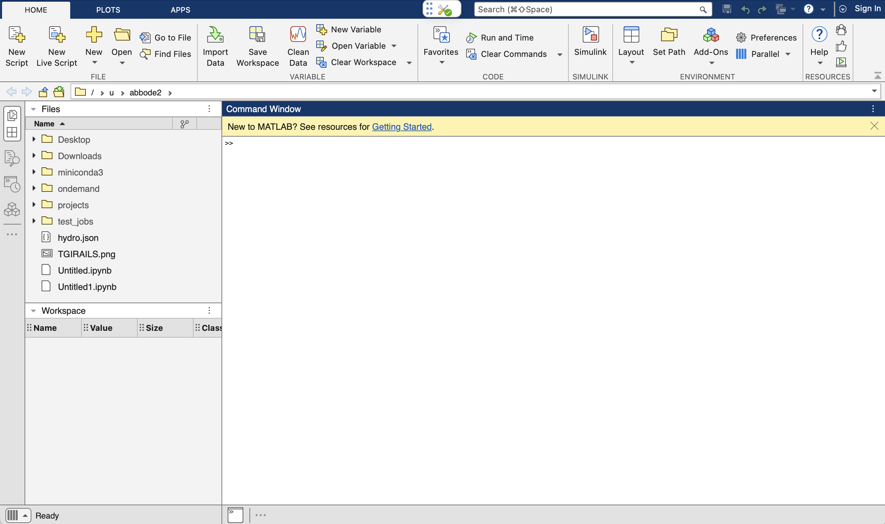

.. _ood-matlab:

MATLAB
========================

.. Note::
   MatLab requires a valid license to use. Some institutions may have a site license for
   MatLab, check with your institution for more information.

MATLAB is a high-level programming language and interactive environment widely used for numerical 
computation, data analysis, algorithm development, and visualization. It is particularly popular 
in engineering, scientific research, and academic fields due to its extensive library of built-in 
functions and toolboxes for specialized applications such as signal processing, machine learning, 
and control systems. MATLAB's intuitive interface and powerful visualization tools make it an 
ideal choice for solving complex mathematical problems and creating interactive simulations. It 
includes the Live Editor for creating scripts that combine code, output, and formatted text in an 
executable notebook. The Open OnDemand dashboard provides an easy way to launch a Matlab 
environment in a web browser.

How to Start an OOD MatLab Session
--------------------------------------

#. Navigate to the `Open OnDemand dashboard <https://railsondemand.ncsa.illinois.edu/>`_.
#. Open the **Interactive Apps** menu at the top of the window and click **MATLAB**.
#. Fill out the form and then click **Launch**.

   - **Name of account** - This must match one of your available RAILS accounts; these are listed under ``Project`` when you run the ``accounts`` command on RAILS.
   - **Name of reservation** - Leave empty if none.
   - **Partition** - Select which partition you want to use for the session. (CPU or GPU)
   - **Number of CPUs** - Select the number of CPUs you want for the session.
   - **Amount of RAM** - Select your RAM following the format example in the form. Note the default RAM assigned if left blank.
   - **Number of GPUs** - Select the number of GPUs you want for the session. Note, you must select the GPU partition to use GPUs.
   - **Duration of job** - Select your duration following the format example in the form. Note the duration limit for interactive partitions.
   - **Additional Modules** - Add any additional lmod modules you need for your session.
   - **Workspace** - Sets the default directory to start the interactive app in.

   \

#. After you click **Launch**, you will be taken to **My Interactive Sessions** where you can view the status of your session.

   .. figure:: images/matlab-queued.png
      :alt: Open OnDemand My Interactive Sessions screen showing the MATLAB session status: "Your session is currently starting...Please be patient as this process can take a few minutes."
      :width: 500

#. Once your session has started, click **Connect to MATLAB** to launch your MATLAB environment. Note, this may take a few minutes.

   .. figure:: images/matlab-running.png
      :alt: Open OnDemand My Interactive Sessions screen showing the MATLAB session with the Connect to MATLAB button.
      :width: 500

#. When you connect to the MatLab session you will be presented with the MatLab session manager interface. This controls the licensing of the matlab server and can be used to start and stop the MatLab server. If your institution has provided a site license for MATLAB, your MATLAB session will automatically start. If not you will need to provide licensing information yourself to access MATLAB. 

    .. figure:: images/matlab-server-starting.png
        :alt: Open OnDemand MATLAB session showing the server starting page.
        :width: 500

#. If you need to provide licensing information, there are two options for doing so. If you have a site license, you will need to enter the server name for the license server. If you have a personal license, you will need to enter your email address and password.

    .. figure:: images/matlab-license-email.png
       :alt: MATLAB session showing the email license authentication page.
       :width: 500
    
    .. figure:: images/matlab-license-server.png
       :alt: MATLAB session showing the site license authentication page.
       :width: 500

#. You are now in your MATLAB environment on Rails. You can view the time remaining on your interactive sessions by clicking **My Interactive Sessions** in the Open OnDemand dashboard.

   .. figure:: images/ood-interactive-sessions-button.png
      :alt: Open OnDemand options at top of window with the My Interactive Sessions button highlighted.
      :width: 750

|
